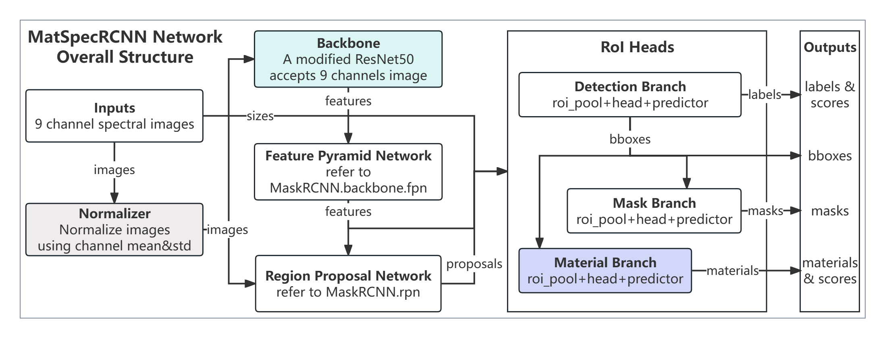
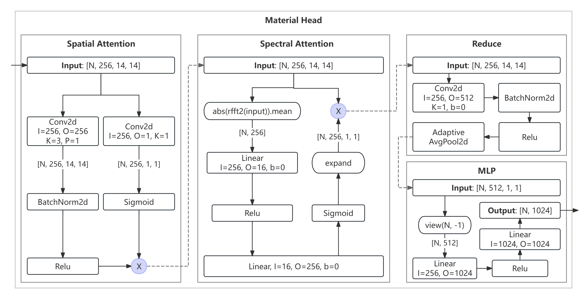
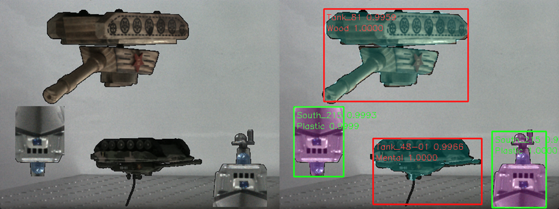

# MatSpecRCNN

**Material Spectral RCNN**: A Multispectral Mask R-CNN for Joint Object Detection and Material Recognition.

This paper proposes a novel multispectral object detection and material recognition network, _MatSpecRCNN_,
which is based on _Mask R-CNN_ and customized for the characteristics of multispectral images. The network
backbone uses 9-channel multispectral image as input, and accepts spectral attention and spatial attention
mechanism during the feature extraction stage to enhance the representation of spectral and spatial features.
Based on the detection and segmentation branches, we designed a _material recognition branch_ that accurately
classifies target materials by using a material-roi(Region of Interest)-pool, a material-head and a
material-predictor within the bounding-box prediction results. Experimental results show that our network
achieves high-precision in object detection and material recognition on custom multispectral datasets,
providing an effective tool for intelligent analysis of multispectral images.

# Images



Figure 1. The overall framework of MatSpecRCNN. Compared to Mask R-CNN, MatSpecRCNN replaces the
_Transform_ with a fixed _Normalizer_, modifies the _Backbone_, and replaces the _Keypoint Branch_
with a new _Material Branch_.



Figure 2. The structure of Material Head. The processing flow can be divided into three stages:
_Spatial Attention_, _Spectral Attention_, and _Feature Projection_. By implementing a _Reduce_
prior to the _Multilayer Perceptron (MLP)_ projection, we achieve a 97% reduction in parameters
while maintaining representational capacity.


Figure 3. Combined illustration of our dataset workflow: (a) Imaging System Hardware，RGB camera
captures horizontally flipped image; (b) Annotation Example, an “Air Write” with many “Delete”;
(c) Affine Example, left shows the RGB image keypoints, right shows the corresponding in grayscale,
lines connect the matched keypoints.



Figure 4. A classic example of MatSpecRCNN. Left shows the RGB image of input multispectral data,
right shows the predictions of bounding box, object region, object classes with confidence and object
material types with confidence.

# Scripts

The `main.py` script accepts the following command‑line arguments:
```text
# position argument:
mode      {train, infer, show}    # "train": run training;
                                  # "infer": perform inference;
                                  # "show": print model summary only

# if running in `show` mode, no other args required

# if running in `train` mode, args list:
-e, --epoch  <int>   Number of epoch, default: 10
-b, --batch  <int>   Batch size, default: 8
-l, --load   <str>   A weights filename, will be load before train if not None, default: None
-s, --save   <str>   The weights filename for save action after train, default: mat-spec-rcnn 

# if running in `infer` mode, args list:
-l, --load   <str>   A weights filename, will be load before infer, required
-b, --batch  <int>   Batch size, default: 8
```

## Example Training Workflow:

```bash
# run in NVIDIA Tesla T4
cd /path/to/MatSpecRCNN
# warm-up train
python -u main.py train --epoch 10 --batch 8 --save warm-up > logs/warm-up/train.log 2>&1 &
# fine-turn train
python -u main.py train --epoch 20 --batch 8 --load warm-up --save self-full > logs/self-full/train.log 2>&1 &
# show model
python main.py show > logs/self-full/model.txt
# inference (run in RTX 3060)
python -u main.py infer --epoch 20 --load self-full --batch 4
```